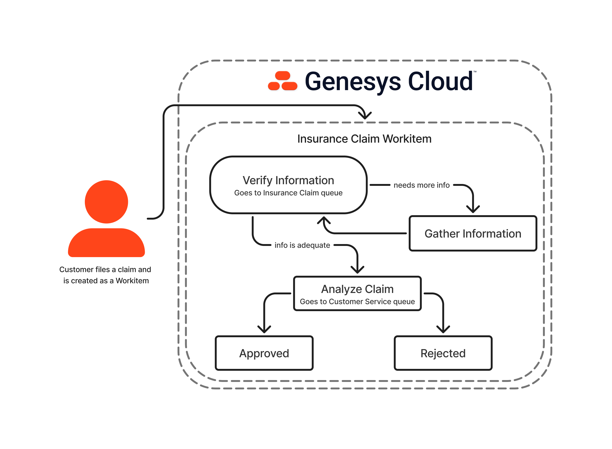

# Using Workitems for Process Automation

This Genesys Cloud Blueprint demonstrates the use of process automation in a simple demonstration that shows a simple process when an insurance claim is being processed within Genesys Cloud with the use of Workitems.

The blueprint [documentation can be seen here](blueprint/index.md "Goes to the blueprint documentation").
