Work automation is an essential tool in the world of customer service. It helps you define tasks and automate their flow according to a pre-defined process that would cater to your business processes. This blueprint shows a template of setting up workitems with a simple demonstration that shows a simple process when an insurance claim is being processed within Genesys Cloud with the use of Workitems.


## Scenario

The insurance claim process starts once a customer submits a claim, which will be created to a workitem. It will be routed to a specified queue that will verify the claim. The agent can change the status to analyze the claim or gather more information. Gathering information will disconnect the agent and will go to a flow that will gather information about the claim. Once it's finished, it will go back to the queue for verification again. If the agent verifies that it has enough information for analysis, it will then proceed to another status called Analyze Claim. This will be routed to another queue that is tasked to analyze the claim given the information gathered. The assigned agent can then approve or reject the claim, which can be applied with necessary business processes.

## Solution Components

- **Genesys Cloud** - a suite of Genesys cloud services for enterprise-grade communications, collaboration, and contact center management.
  - **Work Automation** - a modern, cloud native approach to workitem routing and process automation purpose built for Genesys Cloud. It is intended for work that originates from the contact center to be easily tracked, automated and forecasted for agents.
  - **Architect flows** - a flow in Architect, a drag and drop web-based design tool, dictates how Genesys Cloud handles workflow.
  - **CX as Code** - a tool to declaratively manage Genesys Cloud resources and configuration across organizations using Terraform by HashiCorp.

## Prerequisites

- Specialized Knowledge
  - Administrator-level knowledge of Genesys Cloud.
  - Basic knowledge of Genesys Cloud Architect.
  - Basic knowledge of the Genesys Cloud API.
- Genesys Account Requirements
  - A Genesys Cloud license. For more information, see [Genesys Cloud Pricing](https://www.genesys.com/pricing "Goes to the Genesys Cloud Pricing page").
  - Master Admin role in Genesys Cloud, particularly with permissions in Workitems, Architect, and Routing. For more information, see [Roles and permissions overview](https://help.genesys.cloud/?p=24360 "Goes to the roles and permissions overview in the Genesys Cloud Resource Center") in the Genesys Cloud Resource Center.
  - [OAuth Client](https://help.genesys.cloud/articles/create-an-oauth-client/ "Goes to the Create an OAuth Client article") with the Master Admin role.

## Implementation Steps

This blueprint has 2 implementation steps that allows you to do this manually or use Terraform _(which is highly recommended)_.

- [Clone the repository](#clone-the-repository "Goes to the Clone the Repository section")
- [Manual Implementation via Genesys Cloud UI](#manual-implementation-via-genesys-cloud-ui "Goes to the Manual Implementation via Genesys Cloud UI section")
    1. [Create Queues](#create-queues "Goes to the Create Queues section")
    2. [Create the Workitem Resources](#create-the-workitem-resources "Goes to the Create the Workitem Resources section")
        1. [Create a Workbin](#create-a-workbin "Goes to the Create a Workbin section")
        2. [Create a Work Automation Custom Attributes](#create-a-work-automation-custom-attributes "Goes to the Create a Work Automation Custom Attributes section")
        3. [Create and Configure the Worktype](#create-and-configure-the-worktype "Goes to the Create and Configure the Worktype section")
    3. [Create and Import the Workflow](#create-and-import-the-workflow "Goes to the Create and Import the Workflow section")
- [Using Terraform](#using-terraform "Goes to the Using Terraform section")
    1. [Create a Genesys Cloud OAuth Client](#create-a-genesys-cloud-oauth-client "Goes to the Create a Genesys Cloud OAuth Client section")
    2. [Configure the Terraform Project](#configure-the-terraform-project "Goes to the Configure the Terraform Project section")
    3. [Run Terraform](#run-terraform "Goes to the Run Terraform section")
- [Testing](#testing "Goes to the Testing section")

## Clone the Repository

Clone the [process-automation-workitem-blueprint](https://github.com/GenesysCloudBlueprints/process-automation-workitem-blueprint "Goes to the process-automation-workitem-blueprint repository in GitHub") repository in your local machine. You can also run this git command to clone the repository:

```bash
git clone https://github.com/GenesysCloudBlueprints/process-automation-workitem-blueprint.git
```

## Manual Implementation via Genesys Cloud UI

### Create Queues

Create the following queues in Genesys Cloud: `Insurance Claim` and `Customer Service`. Ensure to assign an agent for each queue that you can use for testing. To know how to create a queue, you may [follow this tutorial](https://help.genesys.cloud/articles/create-queues/ "Goes to the Create and configure queues article at the Genesys Cloud Resource Center").

### Create the Workitem Resources

You need a work automation custom attributes, workbin, and worktype to create a workitem. [Instructions on how to create these can be seen here](https://help.genesys.cloud/articles/set-up-work-automation/ "Goes to the Set Up Work Automation article in Genesys Cloud Resource Center"). You can also follow this guide to follow what is needed for the given scenario.

#### Create a Workbin

1. Go to **Menu** > **Orchestration** > **Work Automation** > **Workbins**.
2. Click **Create New Workbin**—provide the Name, Description, and the Division.
3. Click **Save**.

#### Create a Work Automation Custom Attributes

1. Go to **Menu** > **Orchestration** > **Work Automation** > **Custom Attributes**.
2. Click **Create Schema**—provide the Name and Description.
3. Fill in the following custom attributes:

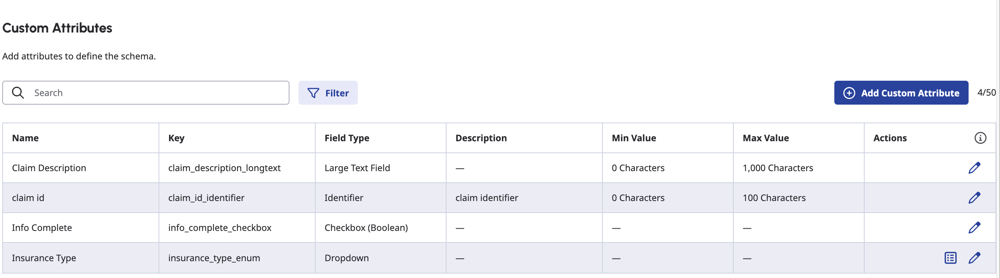

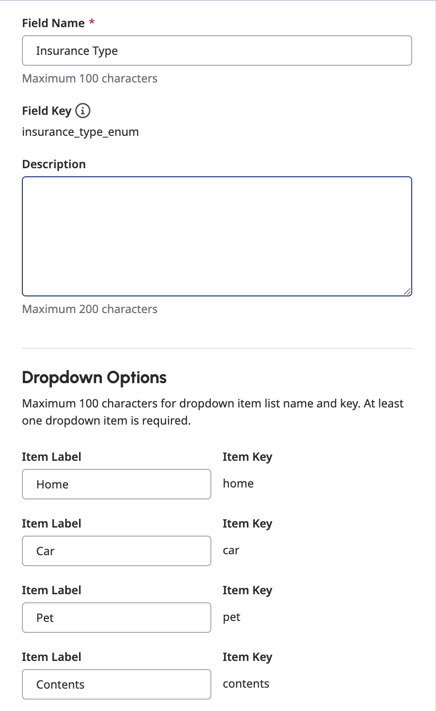

Do take note of the key of the custom attributes that you have set on a given schema, which will be important when creating a workitem for testing later.

4. Click **Save Schema**.

#### Create and Configure the Worktype

1. Go to **Menu** > **Orchestration** > **Work Automation** > **Worktypes**.
2. Click **Create New Worktype**—provide the Name, Description, Division, and the [Workbin we created](#create-a-workbin "Goes to the Create a Workbin section").
3. Click **Save and Modify Settings**.
4. Go to the **Routing** tab. Enable Routing and set the default queue to `Insurance Claim`. Click **Save and Continue** for each tab that we will modify.
5. Go to the **Status Transitions Builder** tab and add the following status and transition restrictions:

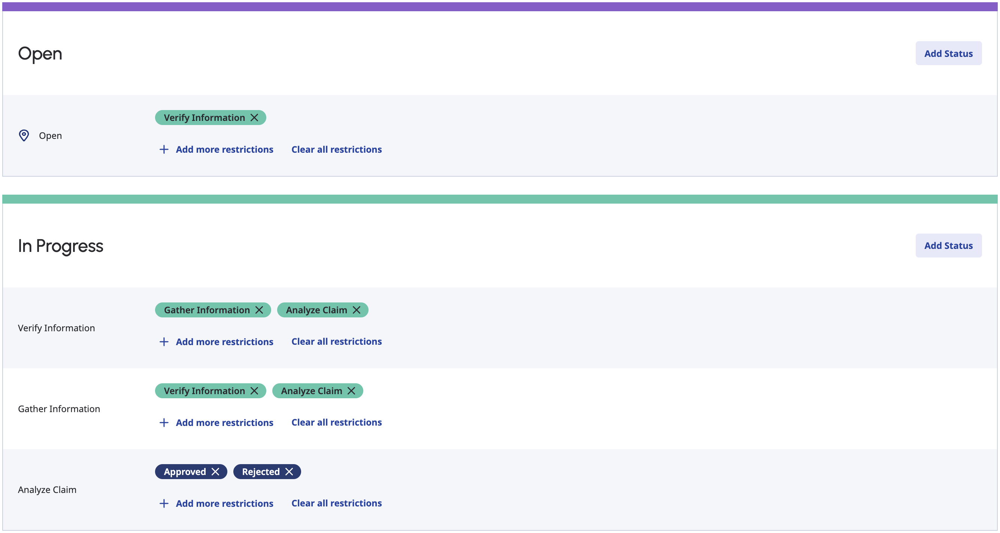

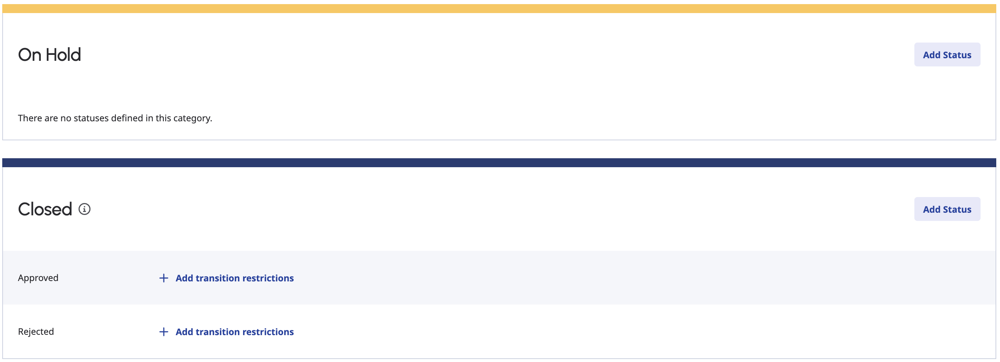

6. Go to the **Auto Status Transitions** tab and set the following:

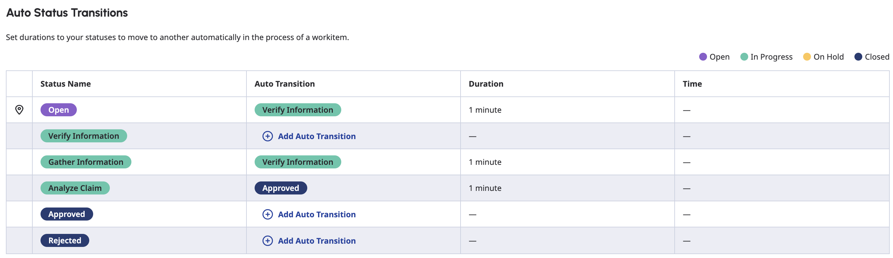

7. Go to the **Schema Display** tab and set the [schema we just created](#create-a-work-automation-custom-attributes "Goes to the Create a Work Automation Custom Attributes section"). Select the Schema version that you want. In this case, use the latest version.

8. Go to the **Rules** tab. Toggle **Enable All Rules** and set the following **Status Transition Rules**:


These rules activate the workitem flow, given those conditions, that we will create in just a moment.

Do take note of the ID of the worktype you just created by looking at the URL when viewing the worktype. It might look like this `https://{your-genesys-domain}/directory/#/admin/worktypes/{the-worktype-id-is-here}/preview`.

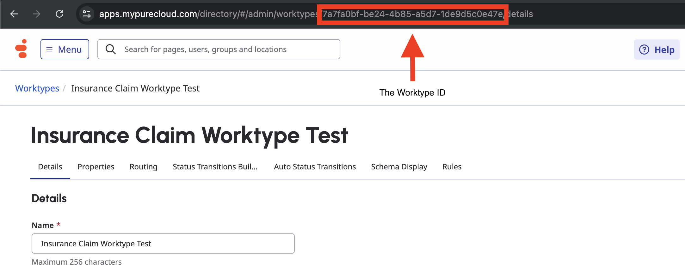

### Create and Import the Workflow

There is a file in the `/exports` folder in the [blueprint repository](#clone-the-repository "Goes to the Clone the Repository section") which is `InsuranceClaimWorkitemFlow.i3WorkitemFlow` that contains the workitem flow.

#### Import the Worklow

1. In Genesys Cloud, navigate to **Admin** > **Architect** > **Flows:Workitem Flow** and click **Add**.

2. Enter a name for the workitem flow, choose the [worktype we created](#create-and-configure-the-worktype "Goes to the Create and Cofigure the Worktype section")  and click **Create Flow**.

3. From the **Save** menu, click **Import**.

4. Select the `InsuranceClaimWorkitemFlow.i3WorkitemFlow` file from `/exports` and click **Import**.

5. Open the reusable task `Status - Analyze Claim` and ensure that the `Transfer to ACD` step targets the queue `Customer Service`. This is also the same with the reusable task `Status - Gather Information` in the `Transfer to ACD` step that targets the queue `Insurance Claim`.

6. Click **Save** and then click **Publish**.

:::primary
**Note**: You can also manually create the flow and copy the flow for `Status - Gather Information` and `Status - Analyze Claim` tasks below. Ensure that the `Generate Flow Logic` is enabled when creating the workitem flow for ease of architecting the flow.
:::

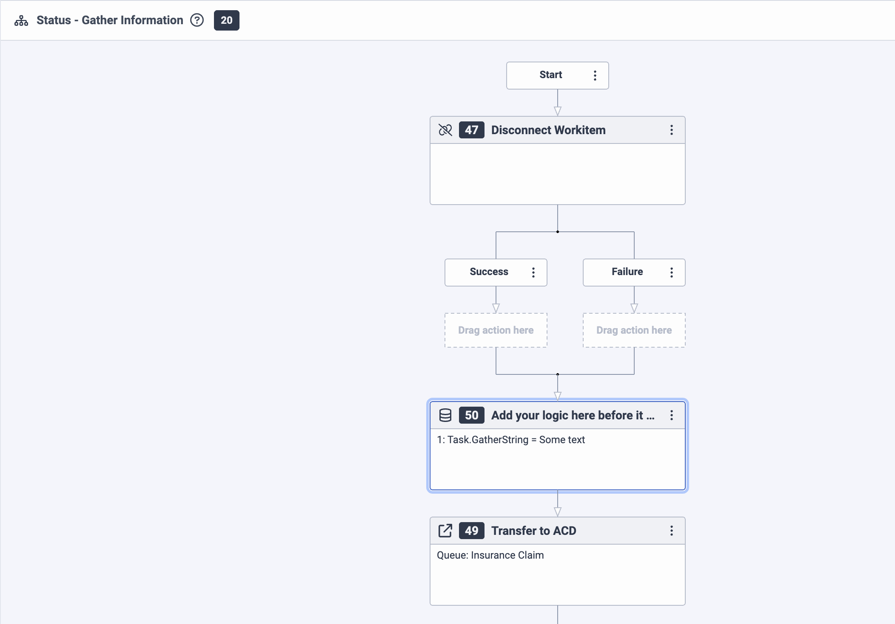

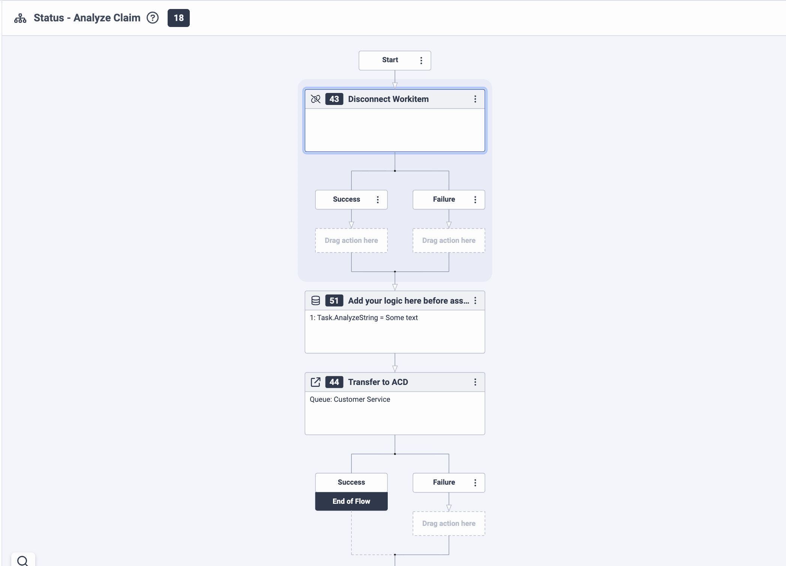

:::primary
**Note**: You may access the custom attributes from the worktype in the variable `Workitem.Workitem.customFields`.
:::

## Using Terraform

When going with this step, ensure that you have installed [Terraform](https://developer.hashicorp.com/terraform/install "Goes to the Terraform website") on your machine.

### Create a Genesys Cloud OAuth Client

The use of an OAuth Client is required for Terraform to create your Genesys Cloud resources. Instructions on how to create one is in this [article](https://help.genesys.cloud/articles/create-an-oauth-client/ "Goes to create an OAuth Client in Genesys Cloud Resource Center"). Do take note of and store securely both the generated `Client ID` and `Client Secret`.

### Configure the Terraform Project

#### Configure the environment variables

In the root directory of the repository, set the following environment variables in your local machine's terminal window before you run this project using the Terraform provider:

- `GENESYSCLOUD_OAUTHCLIENT_ID` - This variable is the Genesys Cloud Client Credential Grant ID that CX as Code executes against.
- `GENESYSCLOUD_OAUTHCLIENT_SECRET` - This variable is the Genesys Cloud Client Credential Secret that CX as Code executes against.
- `GENESYSCLOUD_REGION` - This variable is the Genesys Cloud region in your organization.

These can also be seen in the `dev.env.sh` file for you to use and run to set as environment variables.

#### Configure the Terraform build

In the root directory of the repository, open `dev.auto.tfvars` file, where you need to set the following:

- `environment_name` - The affix that will be added to the names of generated resources.
- `genesys_division_name` - The division name where the Genesys Cloud objects will be created.

:::primary
**Important**: Do not commit a change in the `.tfvars` file that involves saving sensitive information.
:::

### Run Terraform

The blueprint solution is now ready for your organization to use.

To run, issue the following commands:

- `terraform init` - This command initializes a working directory containing Terraform configuration files.  
- `terraform plan` - This command executes a trial run against your Genesys Cloud organization and displays a list of all the Genesys Cloud resources Terraform created. Review this list and make sure that you are comfortable with the plan before you continue to the next step.
- `terraform apply --auto-approve` - This command creates and deploys the necessary objects in your Genesys Cloud account. The `--auto-approve` flag provides the required approval before the command creates the objects. It will then provide the generated `worktypeID` for testing.

After the `terraform apply --auto-approve` command successfully completes, you can see the output of the command's entire run along with the number of objects that Terraform successfully created. Keep the following points in mind:

- This project assumes that you run this blueprint solution with a local Terraform backing state, which means that the `tfstate` files are created in the same folder where you run the project. Terraform recommends that you use local Terraform backing state files **only** if you run from a desktop or are comfortable deleting files.

- As long as you keep your local Terraform backing state projects, you can tear down this blueprint solution. To tear down the solution, change to the `docs/terraform` folder and issue the  `terraform destroy --auto-approve` command. This command destroys all objects that the local Terraform backing state currently manages.

:::primary
**Note**: As of December 2025, destroying/editing workitem transitions might occur a 409 error. You can retry destroying or applying to resolve.
:::

## Testing

To test the solution, you can use a tool like [Postman](https://www.postman.com/downloads/ "Goes to the Postman download page") to send a POST request to create a workitem. Ensure you have an access token or create one with Client Credentials. Also ensure that there are on-queue agents in the queues created for the workitem.

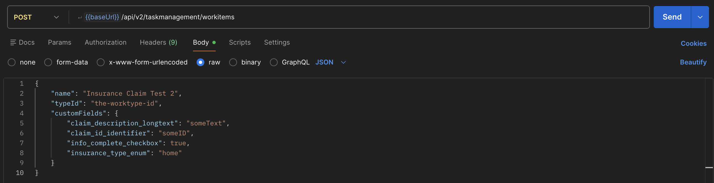

You may also test it via cURL like this:

```bash
curl -X POST \
  'https://api.mypurecloud.com/api/v2/taskmanagement/workitems' \
  -H 'Content-Type: application/json' \
  -H 'Authorization: Bearer {your-access-token}' \
  -d '{
        "name": "Workitem Name",
        "typeId": "the-worktype-id",
        "customFields": {
          "claim_description_longtext": "someText",
          "claim_id_identifier": "someID",
          "info_complete_checkbox": true,
          "insurance_type_enum": "home"
        }
      }'
```

:::primary **Note**: Your API domain endpoint may differ depending on your organization. [Check the article here](https://developer.genesys.cloud/platform/api/ "Goes to the Platform API Overview article in the Genesys Cloud Developer Center") to get the appropriate API Server domain endpoint for your organization's region. :::

The request will return an HTTP `201` response if the workitem is created successfully. You may check the Workitem list located in **Menu** > **Workspace** > **Task List** to see if the workitem is created properly.

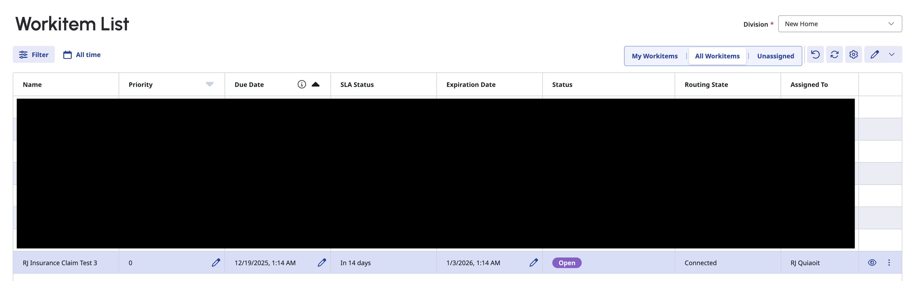

You may also filter the list to that limits the list to the specific worktype used to create the workitem.

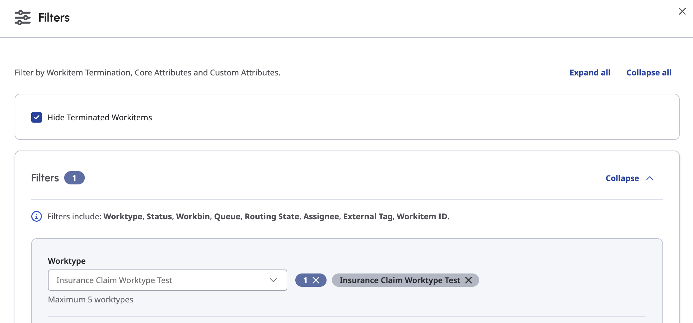

The agent on-queue on the `Insurance Claim` Queue will be assigned to accept the workitem. Accept the workitem. The status of the workitem will move to `Verify Information` 1 minute after the workitem is created.

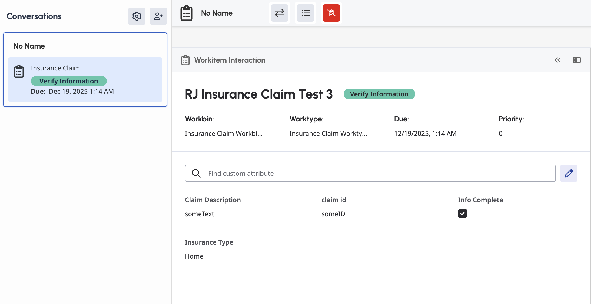

To test when going to the `Gather Information` status, as the agent assigned on the workitem, change the status to `Gather Information`. It will then activate the workflow when the workitem is moved to that status, which will disconnect the agent to the workitem and do it's logic. After that, The workitem will be routed to the same queue before to be verified again and its status will be back to `Verify Information`.

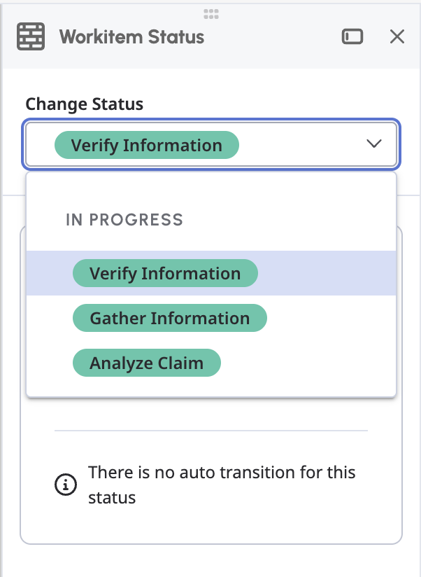

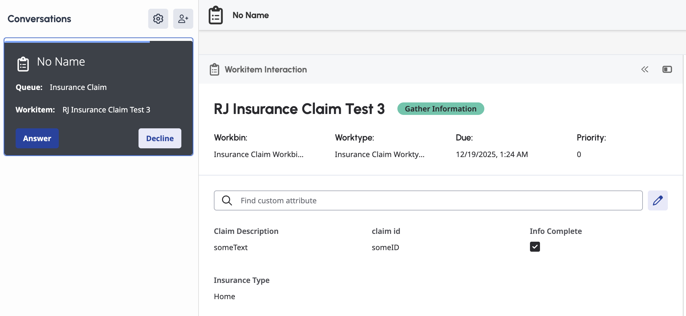

You can then test when changing the status to `Analyze Claim`. The current agent will be disconnected and will then route it to another queue, `Customer Service`, which an on-queue agent can accept it. The workitem is set to transition to `Approved` status after 1 minute.

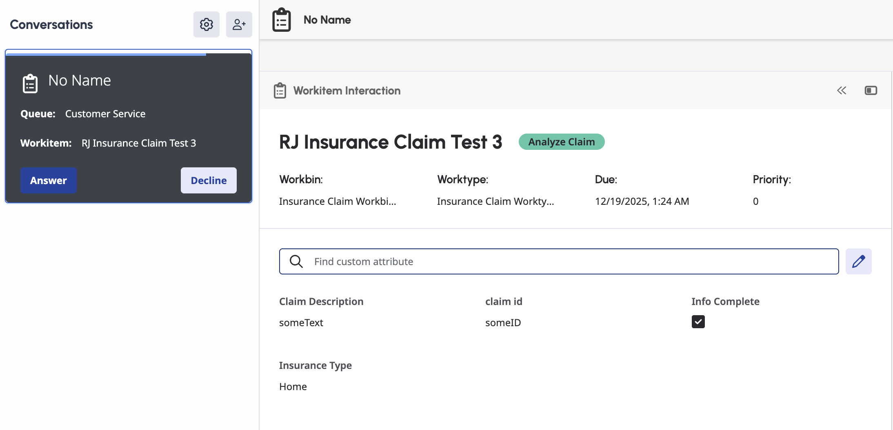

## Additional Resources

- [Task Management in Work Automation Overview](https://developer.genesys.cloud/commdigital/taskmanagement/ "Goes to the Task Management in Work Automation Overview in the Genesys Cloud Developer Center")
- [Genesys Work Automation](https://help.genesys.cloud/usecases/genesys-work-automation-bo01/ "Goes to the Genesys Work Automation article in the Genesys Cloud Resource Center")
- [About Genesys Cloud Architect](https://help.genesys.cloud/articles/about-architect/ "Goes to the About Architect article in the Genesys Cloud Resource Center")
- [Work with workitem flows](https://help.genesys.cloud/articles/work-with-workitem-flows/ "Goes to the Work with workitem flows article in the Genesys Cloud Resource Center")
- [process-automation-workitem-blueprint](https://github.com/GenesysCloudBlueprints/process-automation-workitem-blueprint "Goes to the process-automation-workitem-blueprint repository in GitHub") repository
